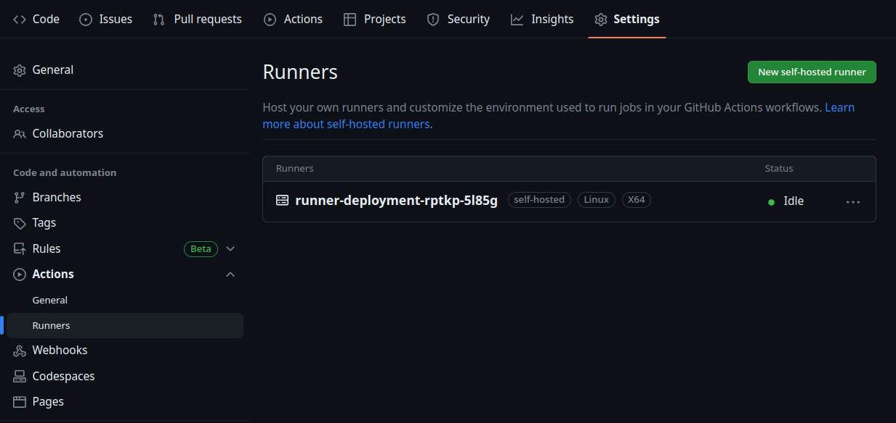
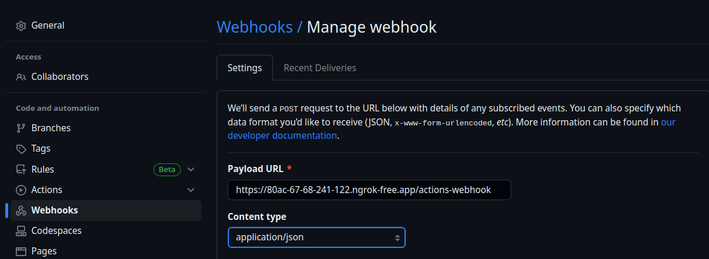

# Selfhosting github actions

To run this small example, follow those steps.  

### Notes
- For this example, the cluster used was a simple minikube cluster using the ingress addon. To reproduce the same behavior, you will need to install an ingress controller on your cluster.

- For the domain, ngrok was used so that github webhooks could reach the cluster.

## Steps

1. Set up a new cluster.

2. Fork this repo to be able to access the settings (to set up webhooks and make sur 
the runners are registered).

3. Replace the token value for the arc/secrets/arc-secret.yaml file by a valid PAT in base 64.

4. Replace the domain value for the arc/nginx-ingress.yaml file by a valid domain that will serve as an endpoint for the webhooks.

5. Run the command:
```
kubectl create -k arc/
```

6. Once everything is up and running, go to the settings of your repository to verify that the runner is registered.


7. Great! You are ready to set up the webhooks from your repo. In the settings, look for webhooks and create a neew one. Make sur to put the correct URL from your domain and endpoint. Put the content type to application/json.


8. Test the thing! Run a workflow from your repo to see if everything is working. You should be able to see the webhooks with a 200 status code and see the jobs running in GitHub. From your cluster, you should see the runners spawn depending on the number of jobs running simmultaneously.